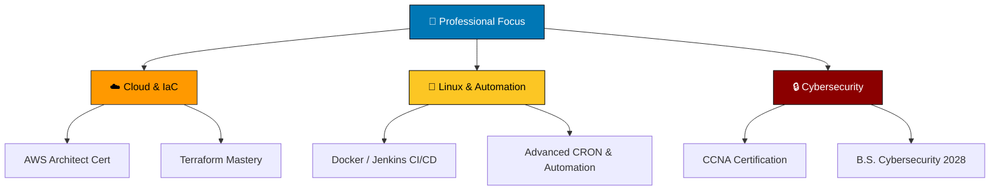

<div align="center">


# 👨‍💻 Yael Calleja

**Linux SysAdmin & Automation Specialist | Cloud Infrastructure | Cybersecurity**

<a href="https://github.com/yaelcalleja">
  
</a>

[](mailto:yael.calleja321@gmail.com)
[](https://www.linkedin.com/in/yael-calleja)
[](https://github.com/yaelcalleja)

<br>


</div>

---

<div align="center">

### 🧭 Quick Navigation

[📊 Stats](#-github-stats) · [👋 About](#-about-me) · [🛠️ Tech Stack](#️-tech-stack) · [💼 Experience](#-experience) · [📜 Certifications](#-certifications--learning) · [🗺️ Roadmap](#️-roadmap)

</div>

---

<div align="center">

</div>

## 📊 GitHub Stats

<div align="center">


<br>


</div>

---

<div align="center">

</div>

## 👋 About Me

```python
class YaelCalleja:
    def __init__(self):
        self.name = "Yael Emmanuel Reveles Calleja"
        self.role = "SysAdmin & Automation Specialist"
        self.location = "Jalisco, Mexico"
        self.education = "Bachelor of Cybersecurity at University of Guadalajara (Jan 2028)"
        
        self.core_philosophy = "Less complexity means fewer configuration errors."
        
        self.focus_areas = [
            "🐧 Building and maintaining critical Linux enterprise infrastructure",
            "☁️ AWS Cloud Solutions & Architecture",
            "📜 Automation via Python & advanced Bash scripting",
            "🔐 Identity and Access Management (IAM) & Network Security"
        ]

    def get_goals(self):
        return "Ensure secured and optimized systems where IT and app environments can thrive."
```

---

<div align="center">

</div>

## 🛠️ Tech Stack

<div align="center">

<a href="https://skillicons.dev">
  
</a>

<br><br>

**Infrastructure & Cloud**


**Programming & Automation**


**Networking & Security**


</div>

---

<div align="center">

</div>

## 💼 Experience

### 🏢 Pastelerias Marisa
**Linux SysAdmin & Automation Specialist | Python & Bash Scripter** *(Jul 2026 - Present)*

*   **Infrastructure Lead:** Built, scaled, and maintained critical infrastructure from day one. Designed architecture models aligning with business needs.
*   **Server Management:** Deployed virtualization and NAS servers. Configured network routing and stateful/stateless firewalls.
*   **Security First:** Enforced least-privilege IAM policies, ensuring robust server security against unauthorized manipulation.
*   **Automation:** Scripted complex CRON jobs using Python and Bash to ensure server autonomy, system optimization, and minimal manual intervention.

---

<div align="center">

</div>

## 📜 Certifications & Continuous Learning

| Certification / Course | Provider | Status | Focus |
|---|---|---|---|
| **AWS Certified Solutions Architect - Associate** | Udemy (Stephane Maarek) | ⏳ In Progress | VPCs, EC2, Cloud Architecture |
| **CCNA Training** | Udemy | ⏳ In Progress | Networking, TCP/IP (Exp. Jan 2028) |
| **Shell Scripting Course** | Udemy | ✅ Completed | Bash, Automation, `grep/sed/awk` |

### 🔍 Currently Exploring
*   **Infrastructure as Code (IaC):** Terraform
*   **Containerization & CI/CD:** Docker, Jenkins

---

<div align="center">

</div>

## 🗺️ Roadmap & Goals



---

<div align="center">


<br>

### 🤝 Let's Connect and Build Secure Systems

[](mailto:yael.calleja321@gmail.com)
[](https://www.linkedin.com/in/yael-calleja)

<br>


**⭐️ [yaelcalleja](https://github.com/yaelcalleja)**

</div>
